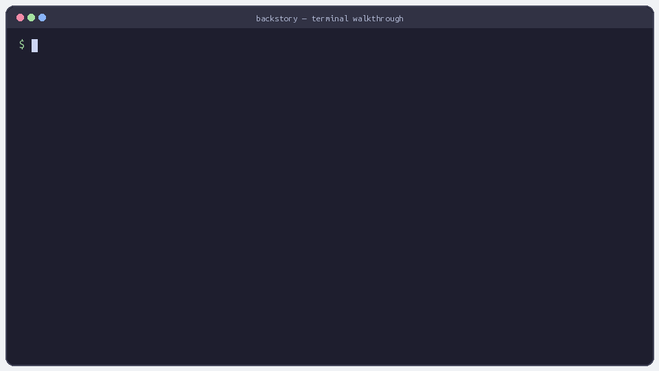

# Backstory

[]()
[]()
[]()
[]()
[]()
[](https://github.com/arpitkath/backstory/actions/workflows/publish.yml)

**Git shows what changed. Backstory shows why.**

Ever opened an AI-generated commit and wondered:

- Why was this approach chosen?
- What did the agent try before this?
- What assumptions are hidden in this code?

## What is Backstory?

Backstory is a local-first AI memory layer for Git repositories. It captures session context from AI coding tools, extracts the durable reasoning (decisions, risks, alternatives), stores it as Google's OKF markdown, and links it to Git commits so you can retrieve the *why* later.

> **Why not just write good commit messages?** Commit messages describe what changed. They rarely capture the rejected alternatives, the risks you accepted, or the reasoning trail across a multi-step AI session. Backstory fills that gap.



## Quick Install

**Install from PyPI** (recommended):

```bash
pip install backstory-cli
```

**Run from source** (no install needed):

```bash
git clone https://github.com/arpitkath/backstory.git
cd backstory
python -m backstory init
python -m backstory test
```

Then initialize and verify in your repo:

```bash
backstory init
backstory test    # verify everything is set up correctly
```

> See a [full worked example](examples/ai-subscription-bug/demo.md) with before/after code and stored session.

## Features

- **Commit-level reasoning** -- `backstory why HEAD` shows why a commit was made, not just what changed
- **Code-aware retrieval** -- Query by file (`backstory file <path>`), line (`backstory line <path>:<line>`), or range (`backstory range <path>:start-end`)
- **Self-test diagnostics** -- `backstory test` verifies installation, storage, hooks, and AI tool settings in one command
- **Contradiction detection** -- Warns when new changes reverse earlier recorded decisions
- **Local-first** -- Everything stays in your repo. No cloud, no telemetry.
- **Human-readable storage** -- Google's OKF markdown that agents, tools, and humans can read
- **Privacy by default** -- Extracts decisions and risks, not raw chat logs. Built-in redaction for API keys and secrets.

## How It Works


1. **Capture** -- Claude Code's `SessionEnd` hook (set up by `backstory init`) copies the transcript to `.backstory/transcripts/latest.jsonl`.
2. **Ingest** -- Backstory extracts the durable decisions, risks, and changed files. The raw conversation is discarded.
3. **Link** -- The session is attached to the relevant Git commit via `backstory attach HEAD`.
4. **Retrieve** -- Query reasoning by commit, file, line, range, or diff.

Git stays the linkage layer. Backstory stores the reasoning.

## Commands

| Command | Status | What it does |
|---|---|---|
| `backstory init` | ✅ Stable | Set up Backstory in the current repo |
| `backstory dump` | ✅ Stable | Ingest an AI session into OKF markdown |
| `backstory attach HEAD` | ✅ Stable | Link a session to a commit |
| `backstory why HEAD` | ✅ Stable | Explain why a commit happened |
| `backstory test` | ✅ Stable | Run self-test to verify installation and setup |
| `backstory search <query>` | ✅ Stable | Search past sessions and decisions |
| `backstory diff` | ✅ Stable | Show prior context for uncommitted changes |
| `backstory file <path>` | ✅ Stable | Show AI context relevant to a file |
| `backstory line <path>:<line>` | ✅ Stable | Show the decision behind a specific line |
| `backstory range <path>:start-end` | ✅ Stable | Show context for a range of lines |
| `backstory code <path>:start-end` | ✅ Stable | Show why a code block exists |
| `backstory redact` | ✅ Stable | Re-scan and redact sensitive data |
| `backstory hooks` | ✅ Stable | Manage Git hook installation |
| `backstory show <session>` | 🧪 Experimental | View a stored session |
| `backstory session-end` | 🔧 Internal | SessionEnd hook handler (used by Claude Code) |

## Integration

**Works with Claude Code automatically** after `backstory init`. Cursor and Codex support planned.

Backstory uses a `SessionEnd` lifecycle hook in `.claude/settings.json` to capture
transcripts automatically — no env vars or manual paths needed:

```json
{
  "env": {
    "CLAUDE_CODE_SESSIONEND_HOOKS_TIMEOUT_MS": "120000"
  },
  "hooks": {
    "SessionEnd": [{
      "hooks": [{
        "type": "command",
        "command": "backstory session-end",
        "timeout": 600,
        "statusMessage": "Archiving session..."
      }]
    }]
  }
}
```

`backstory init` writes this config for you.

Backstory also supports Claude Code v2.1+'s JSONL transcript format natively.

See the [integration guide](docs/integration.md) for step-by-step setup.

## Contradiction Detection

Backstory watches for new changes that appear to reverse earlier recorded decisions.

```text
⚠ This change may contradict a decision from commit 8f21c9a:
  "payment.failed should mark subscription as pending, not cancelled"
```

That turns the tool from an archive into a guardrail.

## Storage

```text
.backstory/
  config.json
  transcripts/
    latest.jsonl
  knowledge/
    index.md
    sessions/
      index.md
      latest.md
      sha256-<session>.md
  redactions/
    tombstones.log
```

Session memory is stored as Google's OKF-style markdown -- human-readable, Git-friendly, and agent-friendly.

## Privacy

Backstory is local-first by design. No cloud service or telemetry is required. Raw transcripts are never persisted -- only extracted decisions, risks, follow-ups, and Git context are kept. Built-in redaction scans for and removes API keys and secrets during ingestion.

## Publishing

New versions are automatically published to PyPI when a GitHub Release is created. See [`.github/workflows/publish.yml`](.github/workflows/publish.yml) for details.

```bash
# Create a release (triggers CI publish)
git tag v0.x.x
git push origin v0.x.x
gh release create v0.x.x
```

## Documentation

- [Integration guide](docs/integration.md) -- Set up with Claude Code and other tools
- [Engineering walkthrough](docs/engineering-walkthrough.md)
- [Product spec](docs/prd.md)
- [Retrieval model](docs/retrieval.md)

---

If you find this useful, [starring the repo](https://github.com/arpitkath/backstory) helps others discover it.
